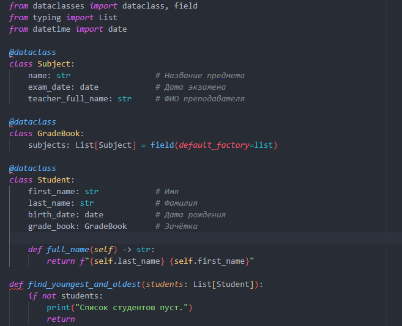
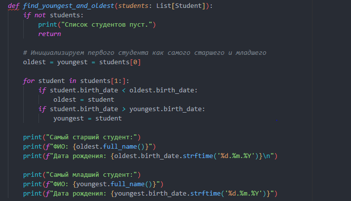
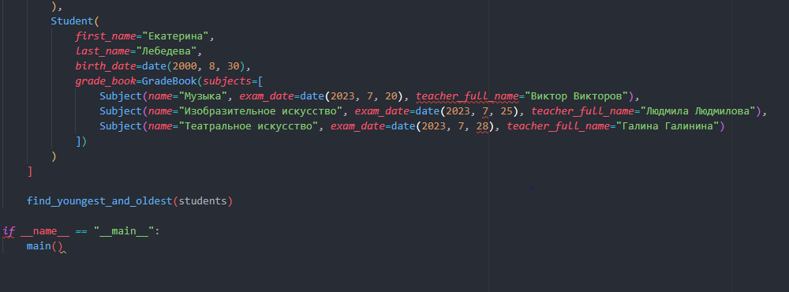
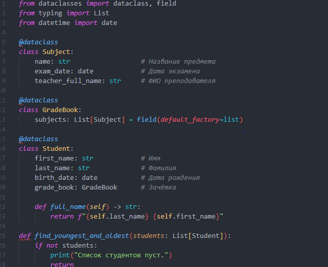

Задание №18
Составить список учебной группы, включающий Х человек. Для каждого студента указать: фамилию и имя, дату рождения (год, месяц и число), также у каждого студента есть зачетка, в которой указаны: предмет (от трех до пяти), дата экзамена, ФИО преподавателя.
Программа должна обладать следующим функционалом:
15.	Вывести ФИО и дату рождения, самого младшего и самого старшего студента

## Структура программы

1. Классы для моделей данных:
   - Student: хранит информацию о студенте.
   - GradeBook (Зачётка): хранит информацию об экзаменах студента.
   - Subject: хранит информацию о конкретном предмете, дате экзамена и ФИО преподавателя.

2. Функции для работы с данными:
   - Добавление студентов и их зачёток.
   - Определение самого младшего и самого старшего студента.
   - Вывод необходимой информации.

. Классы:
   - Subject: представляет отдельный предмет с названием, датой экзамена и ФИО преподавателя.
   - GradeBook: содержит список предметов (Subject) для каждого студента.
   - Student: содержит основную информацию о студенте, включая имя, фамилию, дату рождения и зачётку.

2. Функция find_youngest_and_oldest:
   - Проверяет, не пуст ли список студентов.
   - Инициализирует первого студента как самого старшего и младшего.
   - Проходит по остальным студентам и обновляет переменные oldest и youngest при необходимости.
   - Выводит ФИО и дату рождения самого старшего и младшего студента.

3. Функция main:
   - Создаёт пример списка студентов с заполненными данными.
   - Вызывает функцию find_youngest_and_oldest для отображения результата.
   
   
   

Задание №17
Была написана функция которое принимает в качестве аргумента строку и определяет количество слов в ней
